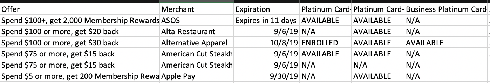

# AmexOffers

A project to view all your American Express Card offers in one place

Sample output will look like this

### Installation instructions

0) Install Python 3 if you haven't already ([instructions](https://realpython.com/installing-python/))

1) Clone the repository or download the Python file as well as the appropriate chromedriver for your OS and place them in the same directory. The included chromedrivers are for Chrome version 75, but if you're using a different version feel free to download the appropriate one from [here](https://sites.google.com/a/chromium.org/chromedriver/downloads)

2) Install the Selenium Python module if it isn't already installed with `python3 -m pip install selenium` or by following the instructions [here](https://selenium-python.readthedocs.io/installation.html)

3) Open up the Python file in your text editor of choice and set `AMEX_LOGIN` and `AMEX_PW` to your American Express login and password, respectively

4) Run the script with `python3 AmexOffers.py`

5) Your offers should be found in `offers.csv` and will be sorted alphabetically by merchant. The script grabs the offers before writing them to the file, so it's normal if nothing shows up at first.
